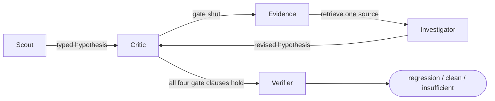

# Beyond Green

Your tests passed. We check what they missed.

**[Open the presentation](https://sashaskind.github.io/safeci/)** ·
[browse the recorded investigations](https://sashaskind.github.io/safeci/viewer/index.html)

<br clear="left">

After an end-to-end test passes, a loop of typed agents investigates the evidence
that test left behind and decides whether the system actually behaved correctly.
Nobody writes prose. Every answer is a choice from a list with a probability
attached, so every branch is ordinary code reading an enumerated value.

## The loop



A Scout proposes a hypothesis. A Critic attacks it and picks what to read next.
An Investigator revises. At most four rounds. Only when all four gate clauses
hold in the same round does a separate Verifier get a vote, and it can veto:

```js
assessment.choice === "supported"
  && assessment.confidence >= minConfidence   // 0.80 by default
  && complete                                 // every required source actually read
  && hypothesis !== "unknown"
```

The model is never asked whether it may conclude. Ten exits exist and nine of
them are refusals, each recording its own reason, so a receipt says *why* a run
gave up. Three of the five steps can end a run without a verdict.
[engine.ts](src/investigation/engine.ts) is the whole loop in 130 lines.

## Measured

Six captures of one archive workflow, two clean controls and four defects, three
of which preserve the bookmark count so counting rows cannot find them. All six
pass the same unmodified upstream browser test and all six final screenshots are
byte-identical. Two independent runs per provider.

| Per investigation | TypeSafe `jev-1.13.0` | DeepSeek-V4-Pro |
|---|---|---|
| Correct verdicts | 4/6 twice | 6/6 twice |
| Wrong verdicts | 0 | 0 |
| False positives | 0 | 0 |
| Latency | 5.3 – 6.1 s | 78.8 – 92.5 s |
| Output tokens | 382 | 9,900 – 11,200 |
| Cost | $0.00054 | $0.0605 – 0.0649 |

Neither model issued an incorrect verdict in 24 investigations. Investigating
250 green tests costs **14 cents** with the cheap provider, **$5.36** with a
cascade that escalates only what it refuses to answer, and **$15.67** with the
larger model alone. The cascade reaches 6/6.

Full results and what they do not establish:
[provider comparison](docs/experiments/linkding-comparison.md) ·
[loop policy](docs/experiments/loop-policy.md) ·
[held-out reproduction](docs/experiments/documenso-held-out.md)

## A real bug nobody here designed

The standing objection to a benchmark like this is that its defects were written
alongside the investigator that finds them, so we reproduced one that was not.
[documenso#2485](https://github.com/documenso/documenso/issues/2485) shipped in
2.6.0, and its own Playwright test loads the corrupted row and asserts the wrong
two columns. Both builds pass; only the defective one claims a signing request
was sent that never was. The investigator does not yet separate them, and
[the write-up](docs/experiments/documenso-held-out.md) says so.

## Start here

`npm ci`, then `npm run ui` opens the local viewer over twelve recorded
investigations with no API keys. [DEMO.md](DEMO.md) is the three-minute demo
runbook. [NEXT_STEPS.md](NEXT_STEPS.md) carries the remaining work and the
invariants that protect these results. The
[MVP plan](Beyond%20Green%20%E2%80%94%20Hackathon%20MVP%20Plan.md) is the
original spec, and [benchmark selection](docs/research/benchmark-selection.md)
records why Linkding came first and which held-out cases come next.

## Local investigation viewer

With Node.js 24+, run `npm ci` and `npm run ui`, then open
[127.0.0.1:4310](http://127.0.0.1:4310). No API keys are needed. Use
`npm run ui -- --port 4311` to choose another port.

The viewer includes twelve recorded Linkding investigations from the second
post-fix study: six captures viewed through both providers, including TypeSafe's
two abstentions. Filter runs, inspect before/after state and operation contracts,
expand recorded agent choices, and compare runs. **Open receipt** accepts an
`investigation.json` or `evaluation.json` file (up to 12 MB / 200 investigations).
Imports stay in browser memory; refresh clears imported data. **Export receipt**
downloads the selected record. The local server serves only viewer assets.

The bundled `ui/demo.json` is a display projection of the saved evaluation, with
source hashes and trace links. It omits repeated prompt state, questions, and
scoring labels; it preserves recorded verdicts, evidence, choices, and timings.
The UI computes state differences for display and does not generate new findings
or invoke models. Private BP/STT captures are not bundled. External source and
Weave links open only when clicked.

For browser checks, run `npx playwright install chromium` once, then
`npm run test:ui`. See [DESIGN.md](DESIGN.md) for the design rules.

## Private worker-cleanup pilot

`npm run bp:prepare -- --repo <private-repo> --manifest <relative-sha256-file>
--run-log <relative-log> --reference-log <relative-log> --run-tests <count>
--reference-tests <count> --contract-file <relative-spec>` prepares a narrow
offline pilot from two complete passing Playwright reporter files. Paths are
relative to the private repository. The supported scenario starts with the
designated baseline license on two workers and promises to restore it after
cleanup. Missing phases, failures, skips, changed source files, and an invalid
reference are rejected.

Generated packets stay in that repository's `scratch/beyond-green-cleanup-*`
directory. `provenance.json` retains source hashes, line references, and private
identity mappings. `outbound-preview.json` shows the pseudonymized observations
and contract available to the investigator. Neither raw logs nor diagnoses are
part of that model input.

`npm run bp:replay -- --packet <private-packet-directory>` validates the pair
without network calls. Once provider use is authorized, add `--send-to-typesafe`
to investigate the reference and candidate using the existing loop. This command
uses TypeSafe directly. Add `--trace` to enable W&B/Weave tracing in `WEAVE_PROJECT`:
the trace contains only projected evidence, questions, and model judgments; raw
logs and local provenance stay private. Each trace is read back to verify its
completed investigation and child calls. Tracing is off when the flag is omitted,
and a dry run makes no network calls even with `--trace`. Receipts stay beside the
private packet; open their `evaluation.json` in the local viewer for trace links.

`npm run bp:run -- --repo <private-repo> --spec <C800732|C800738-partB>
[--baseline-fingerprint sha256:...] [--dry-run]` runs that repository's own
Playwright spec live instead of replaying saved logs. A reporter inside its
Playwright process writes a projection beside the raw diagnostics, so the
investigation never receives the private logs. The investigation runs in a
bounded child process, which keeps a slow provider or a trace failure from
interrupting Playwright cleanup or replacing its exit status. `--send-to-typesafe`
and `--trace` behave as above.

This is a development pair, not a reliability benchmark. It checks recorded worker
cleanup only; it lacks independent product logs and exact run-time spec revisions.
The reference is a different workflow with the same cleanup promise and is reused
as its own context when investigated. The extractor and adapter are generic code;
private source captures and recorded pilot results are not committed here.

## W&B Weave connection

Requires Node.js 24 or newer.

1. Run `npm ci`.
2. Copy `.env.example` to `.env`.
3. Create a personal API key in [W&B User Settings](https://wandb.ai/settings)
   and set `WANDB_API_KEY` in `.env`.
4. Set `WEAVE_PROJECT` to `your-team/beyond-green`, or `beyond-green` for your
   default team. Weave creates the project if it does not exist.
5. Run `npm run weave:check`.

The check uploads one synthetic connection trace, reads it back, and prints its
URL. It makes no model calls and uploads no application evidence. `.env` is
ignored by Git; keep API keys there or in your environment.

Run `npm run check` to type-check the project and `npm test` for local tests.

Reference: [Weave quickstart](https://docs.wandb.ai/weave/quickstart).

## Model connections

Set `TYPESAFE_API_KEY` in `.env`. The investigator defaults to `jev-1.13.0`;
set `TYPESAFE_MODEL` to override it. The standalone connection probe defaults
to `jev-latest` when that environment variable is absent.

The comparison model defaults to `deepseek-ai/DeepSeek-V4-Pro-0813` through
W&B Inference, using the existing `WANDB_API_KEY`. Set
`WANDB_INFERENCE_PROJECT` to the full `team/project` with inference access.
`WANDB_INFERENCE_MODEL` can override the model ID.

Run `npm run models:check` to send one small synthetic evidence question to each
provider. This makes billable model calls. The command validates the answers,
reports token usage and request latency, and saves a receipt in the ignored
`.scratch/model-connectivity.json`. This is a connection check, not an accuracy
or performance benchmark, and it does not send traces to Weave.

References: [TypeSafe HTTP API](https://docs.typesafe.ai/api.md),
[W&B chat completions](https://docs.wandb.ai/inference/api-reference/chat-completions).

## Investigate a passing Linkding test

After capturing the clean/mutant pair, pass their printed artifact directories:

```sh
npm run investigate -- --run <current-run-directory> --baseline <clean-run-directory>
# Use the same investigation loop with the comparison model:
npm run investigate -- --run <current-run-directory> --baseline <clean-run-directory> --provider deepseek
```

This makes billable calls to the selected provider and sends normalized synthetic test evidence
and role trajectories to your Weave project. A Scout proposes a typed
hypothesis; a Critic chooses missing evidence; the Investigator revises its
hypothesis; a separate Verifier checks the final conclusion. The model chooses
retrievals from database state, a pinned archive contract, and a validated
known-good run. Both database state and contract are required before a verdict.

The command prints each decision and writes a complete JSON receipt under
`.scratch/investigations/<id>/`. It verifies the parent trace and child steps
by reading them back from Weave. Exit status is 0 for a completed `clean` or
`regression` investigation, 2 for `insufficient`, and 1 for setup/trace failures;
this is an investigator, not yet a CI gating command.

Experiment labels, patches, local artifact paths, and `run.json` validation
results never enter model state. Missing evidence, exhausted rounds, service
errors, low confidence, or verifier disagreement produce `insufficient`.
The provisional confidence threshold is 0.8; model confidence is not calibrated
correctness. Receipts retain raw probabilities, tokens, and latency. Dollar
cost remains unavailable rather than being reported as zero.

The first live pair produced **clean** for the baseline and **regression** for
the deletion, with both browser tests still passing. See the
[recorded investigation](docs/experiments/linkding-typesafe.md) for evidence,
Weave links, and limitations.

## Compare TypeSafe and DeepSeek

```sh
npm run benchmark:linkding:suite
npm run evaluate -- --suite <printed-suite.json-path>
```

The six-case suite contains two clean controls and four archive defects. All six
run the unchanged upstream browser test. Three defects preserve the bookmark
count while corrupting a field, losing an association, or changing another
owner's state. Ground truth comes from exact state validators in the capture
harness. The evaluator checks artifact hashes before and after each investigation;
case names and expected verdicts are used for scoring, never sent to the models.

Both providers use the same engine, evidence catalog, contract, questions, four
critic-round limit, and provisional 0.8 acceptance threshold. Each chooses its
own retrieval trajectory. DeepSeek runs with reasoning enabled, an 8,192-token
response budget, and a 90-second request timeout; TypeSafe has a 30-second
request timeout. Neither adapter retries. DeepSeek's generated confidence and
probabilities are self-reported, unlike TypeSafe's native distributions, so the
identical threshold does not establish equivalent calibration.

`--repeats 1-10` repeats model investigations on the same captured evidence;
it does not create new browser samples. `--provider typesafe` or `--provider deepseek`
runs only that provider. By default, both run once per case with alternating
provider order. Receipts under `.scratch/evaluations/<id>/evaluation.json` retain
every result, code and artifact fingerprints, model configuration, and trace URL.
Interrupted or unverifiable evaluations remain marked incomplete. Completed
evaluations may contain wrong or insufficient verdicts and still exit 0.

Weave stores a versioned dataset, separate provider evaluations, per-case
correctness/abstention scores, and linked full investigation traces. Summary
accuracy includes abstentions in its denominator; confusion counts distinguish
wrong verdicts from abstentions. Token totals include only successfully parsed
responses and therefore undercount billing when requests fail. Comparable billed
cost remains unavailable; the report includes partial Weave estimates for DeepSeek.
Across the two most recent studies, TypeSafe returned 4 of 6 correct verdicts
with 2 reproducible abstentions at about 5–6 seconds and $0.00054 per
investigation, and DeepSeek returned 6 of 6 at about 79–93 seconds and $0.06.
Neither issued an incorrect verdict or a false positive in 24 investigations.
TypeSafe's cost is arithmetic on its published input-token rate; DeepSeek's is a
Weave default-rate estimate, so the two are not equally firm. Both providers
consume a similar volume of input tokens, so the cost difference is the rate
rather than efficiency. See the
[provider comparison](docs/experiments/linkding-comparison.md) for all four
studies, the validator defect that invalidated the earlier abstention counts,
and the limits these six captures cannot exceed.

## Tune the loop from its own traces

Four commands turn recorded runs into policy. None of them touches the operation
contract, which is the part that needs a human. Results and limits:
[loop policy](docs/experiments/loop-policy.md).

```sh
# Escalate only what the cheap provider refuses to answer.
npm run cascade -- --suite <suite.json> [--escalateOn insufficient,regression]

# Re-run the whole suite at several acceptance thresholds and measure each.
npm run sweep -- --suite <suite.json> [--thresholds 0.3,0.5,0.8]

# Collect every case where two providers disagreed. Needs no ground truth.
npm run disagreements -- [--publish]

# Project what the same loop would cost on models never run here.
npm run cost:project -- <evaluation.json...> [--tests 250]
```

The cascade reaches 6/6 by escalating 2 of 6, at a third of the larger model's
cost. The sweep costs about two cents for 42 investigations and shows the 0.80
default is conservative on this suite. Across four studies the providers never
contradicted each other: all six disagreements were one of them giving up, which
is exactly what a cascade fills.

Two cautions. Tuning a threshold on the same six cases you measure is
overfitting, so treat the sweep as a lead rather than a setting to ship. And a
cascade's accuracy is bounded by its most capable tier, which returned a false
positive on the Documenso control.
